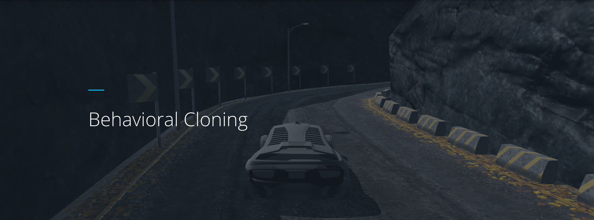
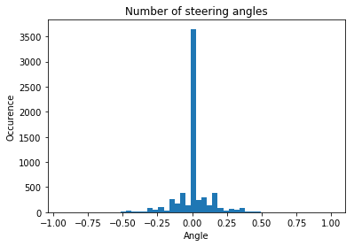
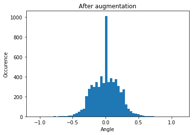
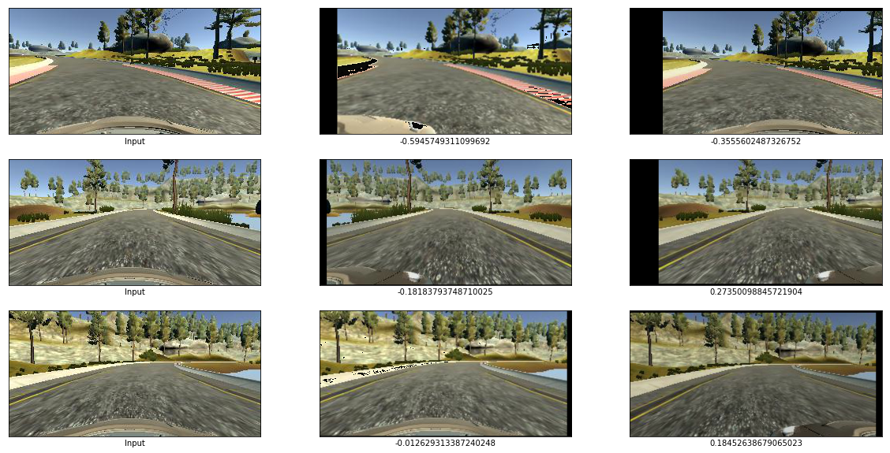
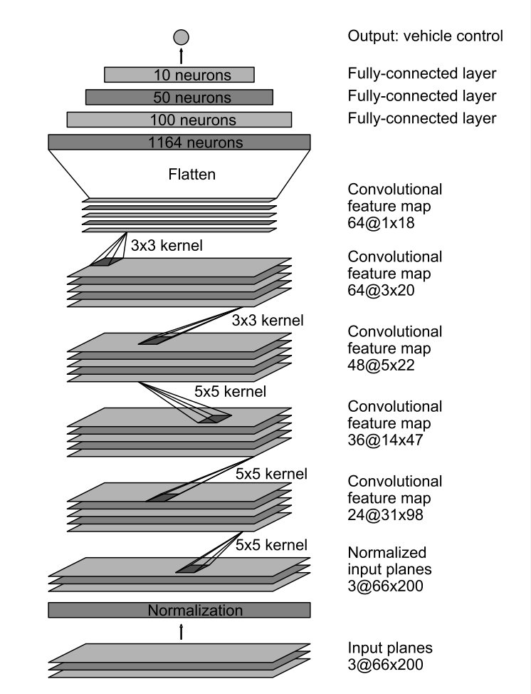
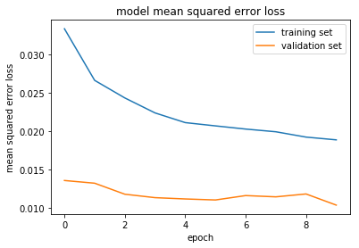

# Udacity Behavioral Cloning Project



## Introduction

In this project the goal is to apply an end to end neural network that can drive autonomously in a simulator. The simulator provided by Udacity allows to collect driving data that provides recorded images (left, center,right facing the road) as well telemetry information such as steering angle, throttle and speed of the vehicle for each data point. The simulator also has an interface to control the vehicle programmatically so we can use the trained model to do the driving for us.


## Driving data
To train the neural network, the recorded data should be well balanced and should have variation for different driving situations.
I chose to use the provided small data set from udacity instead of recording my own data.

A quick look into the provided data shows that the steering angle distribution is not well balanced. Most of the time the steering wheel angle is zero, and this can cause the trained model on this data set to be biased towards driving straight ( zero angle).

The total images in the training set is 6428.



To overcome this I used augmentation techniques. Each image went through random flip, random traslation, random brightness change and left and right camera images are also being selected randomly. Adding steering wheel adjusted left and right camera images to the input set brings the number of total images to 19284.

One advantage of using random is that if we would decide to use more training epochs, the data that the network trains on would be always a little different on each run. This can help the model to generalize better.



Below some example images after the augmentation given random images from the training set:




## Model

I have chosen the Nvidia model and added some dropout layers to reduce overfitting. I have also baked in the preprocessing steps into the model. The model could parallelize some of this preprocessing that could make the execution faster. Doing this also will not require changes in the `drive.py` since the exported model file `model.h5` will include these steps, thus the raw images coming from the "camera" can be fed in directly into the model. Following preprocessing steps are included:

* Cropping layer: Cropping out the bottom 20 pixels as well as the top 50 pixels from each image, that doesn't contain any useful data for driving purposes (the sky and/or the hood of the car).
* Resizing layer: The origial Nvidia model is well documented is being used for and input of 66x200 pixel with 3 color channels. To keep it at the same size this resizing step is bein applied. [[nvidia paper](https://arxiv.org/pdf/1704.07911.pdf)]
* Normalization layer

The Nvidia model consists of 5 convolution layers following 3 fully connected layers. It takes 66x200x3 input data points and one output for the steering wheel prediction.



The final model consists of 252,219 parameters. See below for the breakdown:
 
```

    _________________________________________________________________
    Layer (type)                 Output Shape              Param #   
    =================================================================
    crop (Cropping2D)            (None, 90, 320, 3)        0         
    _________________________________________________________________
    resize (Lambda)              (None, 66, 200, 3)        0         
    _________________________________________________________________
    normalize (Lambda)           (None, 66, 200, 3)        0         
    _________________________________________________________________
    conv2d_1 (Conv2D)            (None, 31, 98, 24)        1824      
    _________________________________________________________________
    conv2d_2 (Conv2D)            (None, 14, 47, 36)        21636     
    _________________________________________________________________
    conv2d_3 (Conv2D)            (None, 5, 22, 48)         43248     
    _________________________________________________________________
    conv2d_4 (Conv2D)            (None, 3, 20, 64)         27712     
    _________________________________________________________________
    conv2d_5 (Conv2D)            (None, 1, 18, 64)         36928     
    _________________________________________________________________
    dropout_1 (Dropout)          (None, 1, 18, 64)         0         
    _________________________________________________________________
    flatten_1 (Flatten)          (None, 1152)              0         
    _________________________________________________________________
    dense_1 (Dense)              (None, 100)               115300    
    _________________________________________________________________
    dropout_2 (Dropout)          (None, 100)               0         
    _________________________________________________________________
    dense_2 (Dense)              (None, 50)                5050      
    _________________________________________________________________
    dropout_3 (Dropout)          (None, 50)                0         
    _________________________________________________________________
    dense_3 (Dense)              (None, 10)                510       
    _________________________________________________________________
    dense_4 (Dense)              (None, 1)                 11        
    =================================================================
    Total params: 252,219
    Trainable params: 252,219
    Non-trainable params: 0

```

## Training


The data is being split into training and validation sets with a ratio of 80/20. The model parameters were optimized using the Adam optimizer and the learning rate is not manually adjusted. Mean squared error was used as a loss function. After 10 epoch the training and validation loss showed that there is no over/underfitting. 




## Results and conclusion

The neural network is able to drive on both tracks (on slow speeds for track #2) although the network has never seen the second track. It was great to see that the network was able to generalize well. The key factor for success is definitely the quality of the training data with good variation and well balanced to reduce bias.

One little lesson for me was that the provided `drive.py` uses the PIL image library for reading/writing images. Training images that were opened with OpenCV libraries can lead to errors in the beginning since OpenCV stores in BGR format versus PIL does it in RGB color ordering format. However a well trained model should be able generalize to account for these types of variations.

Here the link for the [video] on track 1(../code/run1.mp4).


